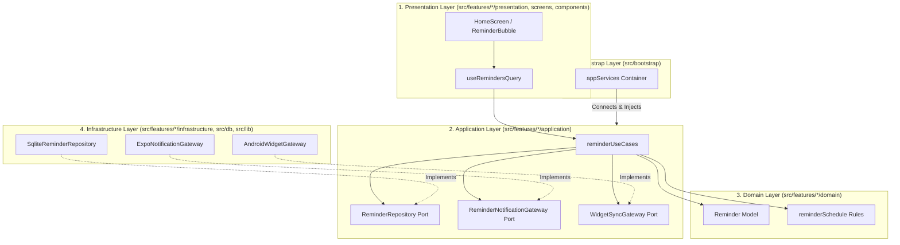

# React Native Architecture & Alignment Policy

本プロジェクトは **React Native New Architecture** を有効化した上で、クリーンで保守性の高い **Feature-First Hexagonal Architecture (Ports & Adapters)** を採用しています。外部ライブラリやネイティブ層への直接依存を隠蔽し、ドメインロジックの単体テスト可能性とプラットフォーム抽象化を担保します。

---

## 🏗️ 依存方向とレイヤー構造

---

## 🛡️ レイヤー境界の厳格な定義

### 1. Domain Layer (`src/features/*/domain/`)

- **役割**: ビジネスモデル、データ構造、純粋な判定ルール。
- **制約**: React、React Native、Expo、SQLite 等の外部ライブラリを一切 import してはならない。純粋な TypeScript のみで記述する。

### 2. Application Layer (`src/features/*/application/`)

- **役割**: ユースケースの実現および Port（インターフェース）の定義。
- **制約**: 具体的なインフラストラクチャ実装（SQLite、Expo Notifications 等）を直接 import してはならない。抽象化された Port のみを呼び出す。

### 3. Infrastructure Layer (`src/features/*/infrastructure/`, `src/db/`, `src/lib/`)

- **役割**: 永続化（SQLite / Drizzle）、ローカル通知（Expo Notifications）、Widget（Android Widget）などの外部統合。
- **制約**: Port インターフェースを実装し、DB の行型と Domain のモデル型を明示的に相互変換する。

### 4. Presentation Layer (`src/features/*/presentation/`, `screens/`, `components/`)

- **役割**: ユーザーインターフェース描画およびユーザー操作のハンドリング。
- **制約**: `infrastructure` の具体実装を直接 import しない。TanStack Query の Query/Mutation Hook 経由で `application` のユースケースを呼び出す。

### 5. Bootstrap Layer (`src/bootstrap/`)

- **役割**: アプリ起動時の初期化、依存関係の接続 (Dependency Injection)、Deep Link 意図の解釈。
- **制約**: Port と具体実装をバインドし、`appServices` としてアプリケーション全体に供給する唯一の場所。

---

## 💾 状態の所有権 (State Ownership & SSOT)

| 状態の種類               | 管理ライブラリ / 場所 | 用途と所有権                                                 |
| :----------------------- | :-------------------- | :----------------------------------------------------------- |
| **永続的状態 (SSOT)**    | SQLite (Drizzle ORM)  | リマインダーデータ、ユーザー設定の唯一の永続的な真実         |
| **非同期キャッシュ状態** | TanStack Query        | DB からの読み込み、キャッシュ更新、画面間自動同期            |
| **一時的 UI 状態**       | Zustand               | Quick Add の下書き、メニュー開閉、開発用デバッグ設定         |
| **画面ローカル状態**     | Component State       | 削除モーション中のバブルID、選択状態、ローカルアニメーション |
| **Deep Link 状態**       | Expo Router Params    | Widget や通知クリックからの画面遷移インテント                |

---

## 🔌 外部境界 (Ports & Services)

リマインダーの追加・更新・削除・期限切れクリーンアップなどの副作用を伴う処理は、すべて以下の Port を通して実行されます。

- `ReminderRepository`: SQLite データベースへの保存・取得・削除。
- `ReminderNotificationGateway`: ローカル通知の予約・キャンセル・権限確認。
- `WidgetSyncGateway`: Android Widget スナップショットの同期。

これらの Port を束ねるユースケースは、`src/bootstrap/appServices.ts` において具象実装と接続されます。
