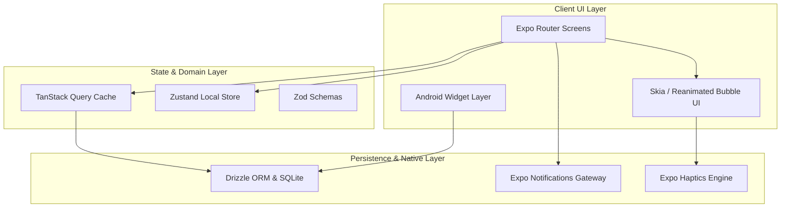

# 技術スタック (Technology Stack)

`pop-reminder` は、Expo / React Native / Expo Router を基盤にした Android・iOS・Web 対応のリマインダーアプリケーションです。SQLite によるローカル永続化、通知、Android ホーム画面 Widget、プラットフォーム別最適化アニメーションを採用しています。

---

## 🏗️ システムコンポーネント構成図



---

## 1. コア・プラットフォーム (Core Platform)

| 技術 / ライブラリ | バージョン | 用途・説明                                                            |
| :---------------- | :--------- | :-------------------------------------------------------------------- |
| **Expo SDK**      | `~54.0.35` | アプリケーション基盤、ネイティブ設定管理およびビルド統合              |
| **React Native**  | `0.81.5`   | iOS / Android のクロスプラットフォーム Native UI レンダリング         |
| **React**         | `19.1.0`   | コンポーネント指向 UI ライブラリ                                      |
| **TypeScript**    | `~5.9.3`   | 型安全なアプリケーション開発環境                                      |
| **Expo Router**   | `~6.0.24`  | `src/app/` を起点としたファイルベースルーティング (Typed Routes 有効) |

---

## 2. 状態管理・ドメイン処理 (State & Domain)

| 技術 / ライブラリ  | バージョン | 用途・説明                                                        |
| :----------------- | :--------- | :---------------------------------------------------------------- |
| **TanStack Query** | `^5.0.0`   | SQLite をデータソースとする非同期取得・mutation・画面間自動同期   |
| **Zustand**        | `^5.0.5`   | Quick Add の下書き状態・UI 開閉および開発用設定のローカル状態管理 |
| **Zod**            | `^3.25.64` | 入力トリミング、文字数制御、日付時刻妥当性検証スキーマ            |
| **date-fns**       | `^4.1.0`   | 日付計算、期限判定、フォーマット処理                              |

> 📌 **永続化のポリシー**  
> SQLite を唯一の永続的な真実 (Single Source of Truth) とし、TanStack Query のキャッシュは永続化しません。

---

## 3. データベース・永続化 (Database & Persistence)

ローカルデータは端末内の SQLite データベースに保存されます。専用のマイグレーションパッケージを使わず、`src/db/migrations.ts` が `PRAGMA user_version` に基づき冪等な自動マイグレーションを実行します。

| 技術 / ライブラリ    | バージョン | 用途・説明                                       |
| :------------------- | :--------- | :----------------------------------------------- |
| **expo-sqlite**      | `~16.0.10` | SQLite データベースへのネイティブアクセス        |
| **Drizzle ORM**      | `^0.44.2`  | テーブル定義、型安全な CRUD クエリ               |
| **expo-file-system** | `~19.0.23` | DB ファイル保存先（Document ディレクトリ）の取得 |

---

## 4. UI・スタイリング・アニメーション (UI & Interaction)

| 技術 / ライブラリ                | バージョン       | 用途・説明                                                    |
| :------------------------------- | :--------------- | :------------------------------------------------------------ |
| **NativeWind / Tailwind**        | `^4` / `^3.4.17` | Tailwind CSS クラスを用いたユーティリティファーストな UI 記述 |
| **react-native-reanimated**      | `~4.1.7`         | ワークレットベースの高精細 UI アニメーション                  |
| **@shopify/react-native-skia**   | `2.2.12`         | iOS 向けの泡破裂エフェクト、水滴描画                          |
| **@gorhom/bottom-sheet**         | `^5.1.4`         | リマインダー追加・詳細表示用 Bottom Sheet                     |
| **react-native-gesture-handler** | `~2.28.0`        | タッチ・フリックジェスチャーのネイティブ処理                  |
| **expo-linear-gradient**         | `~15.0.8`        | 泡およびグラデーション背景の描画                              |

---

## 5. ネイティブ統合・Widget (Native Features)

| 技術 / ライブラリ               | バージョン | 用途・説明                                               |
| :------------------------------ | :--------- | :------------------------------------------------------- |
| **expo-notifications**          | `~0.32.17` | ローカル通知予約・キャンセル、Android 通知チャンネル構築 |
| **react-native-android-widget** | `^0.20.3`  | Android ホーム画面 Widget の描画・タスク同期             |
| **expo-linking**                | `~8.0.12`  | 通知や Widget からの Deep Link 処理                      |
| **expo-haptics**                | `~15.0.8`  | 泡が破裂する際の物理ハプティクスフィードバック           |
| **posthog-react-native**        | `^4.62.0`  | 匿名イベント計測、手動画面追跡、永続的な opt in / out    |

---

## 6. 開発環境・ビルド・品質管理 (Tooling & Quality)

| 技術 / ライブラリ | バージョン / 設定 | 用途・説明                                    |
| :---------------- | :---------------- | :-------------------------------------------- |
| **Node.js**       | Nix `v24.16.0`    | 開発シェルの規定環境                          |
| **pnpm**          | `10.8.1`          | パッケージマネージャー                        |
| **@types/node**   | `^24.0.0`         | Node.js ビルトインモジュール型定義            |
| **Biome**         | `^2.5.2`          | 高速 Lint & コードスタイルチェック            |
| **Prettier**      | `^3.9.4`          | 全体コードフォーマッター                      |
| **Lefthook**      | `^2.1.9`          | Git Pre-commit フックによる検証強制           |
| **MVH**           | `scripts/mvh-*`   | 設定改竄防止ガード & Codex 自動フィードバック |

---

## 7. ディレクトリ構造マッピング

```text
src/
├── app/               # Expo Router の画面エントリポイント
├── app-tests/         # ルーティング・アーキテクチャ回帰テスト
├── bootstrap/         # DI・AppInit・Deep Link 組み立て
├── constants/         # カラートークンおよび共通定数
├── db/                # SQLite スキーマ、Drizzle client、Migration
├── features/
│   ├── reminders/     # リマインダー機能 (domain, application, infrastructure, presentation, UI)
│   └── settings/      # 設定機能 (domain, application, infrastructure, presentation, UI)
├── lib/
│   ├── analytics/     # PostHog Adapter・イベント許可リスト
│   └── notifications/ # Expo Notifications 管理
├── shared/            # 共通 UI コンポーネントおよびユーティリティ
├── test-utils/        # ソース契約・テストヘルパー
└── widget/            # Android Widget snapshot & 更新ロジック
```
